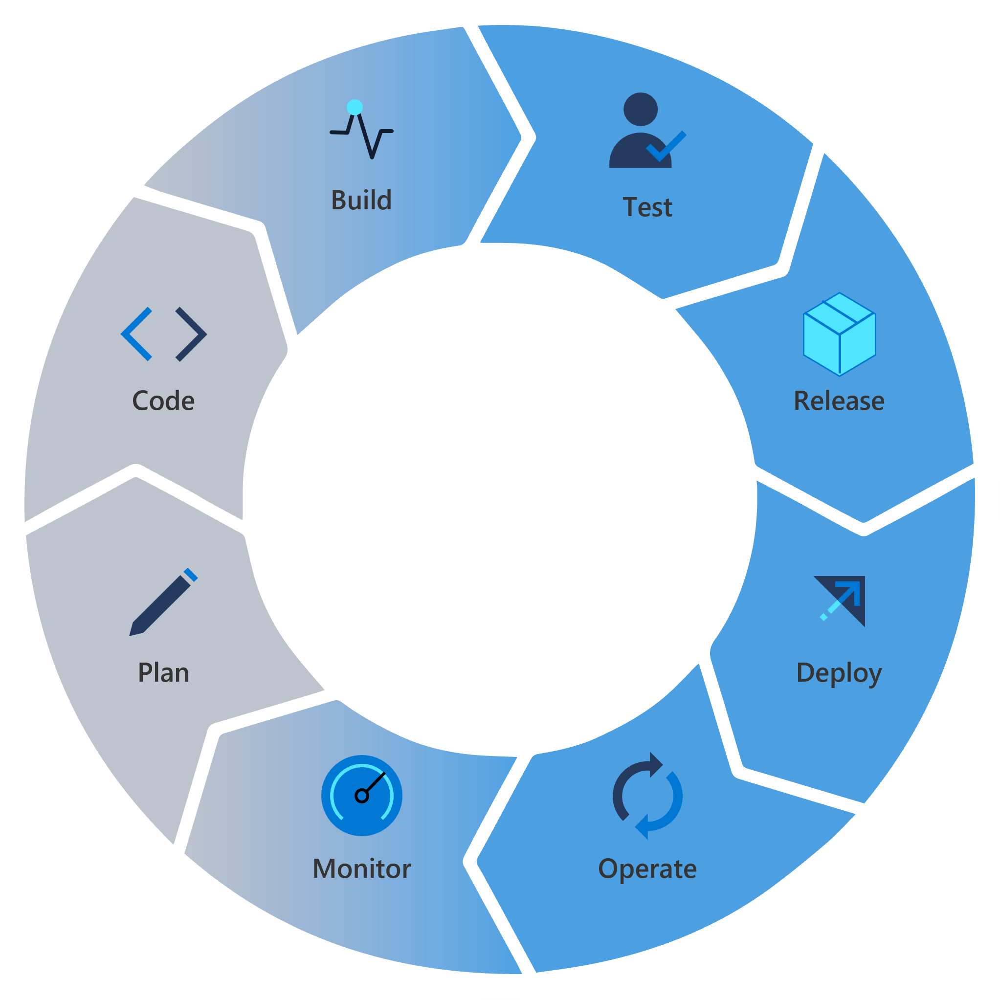

# azure-devops-github-intro

---

| Page Type | Languages | Services                                        |
| --------- | --------- | ----------------------------------------------- |
| Sample    | C#        | Azure DevOps   Azure App Service   GitHub |

---

# Setting up Azure DevOps

This document seeks to cover key features in Azure DevOps and GitHub by providing relevant resources so that basic end-to-end DevOps tooling can be utilized. This document aims to serve as a collection of useful documents/links, and **does not intend to be an exhaustive or step-by-step guide**.
 
The sample code in this repository contains a basic build configuration, infrastructure-as-code, and .NET application code that can be imported into Azure DevOps (or leveraged directly from this repository) to help accelerate/provide a reference point for new projects.

 

_Detailed phases of the DevOps cycle._

[Link to task list for establishing a DevOps practice in your organization](Docs/DevOpsChecklist.md)

---

| DevOps Phase/Area   | Azure DevOps tool                                                                                                                                                                                                         | GitHub Tool                                                                                                                                                           |
| ------------------- | ------------------------------------------------------------------------------------------------------------------------------------------------------------------------------------------------------------------------- | --------------------------------------------------------------------------------------------------------------------------------------------------------------------- |
| Planning            | [Boards](https://azure.microsoft.com/en-us/products/devops/boards/)                                                                                                                                                       | [Issues](https://docs.github.com/en/issues), [Projects](https://docs.github.com/en/issues/planning-and-tracking-with-projects/learning-about-projects/about-projects) |
| Collaboration       | [Repos](https://azure.microsoft.com/en-us/products/devops/repos/)                                                                                                                                                         | [Repos](https://docs.github.com/en/repositories)                                                                                                                      |
| Development (local) | [Visual Studio](https://visualstudio.microsoft.com/)/[Visual Studio Code](https://code.visualstudio.com/)                                                                                                                 | [Visual Studio](https://visualstudio.microsoft.com/)/[Visual Studio Code](https://code.visualstudio.com/)                                                             |
| Development (cloud) | [Dev Box](https://azure.microsoft.com/en-us/products/dev-box/)                                                                                                                                                            | [Codespaces](https://docs.github.com/en/codespaces)                                                                                                                   |
| Delivery            | [Pipelines](https://learn.microsoft.com/en-us/azure/devops/pipelines/get-started/what-is-azure-pipelines?view=azure-devops), [Test Plans](https://learn.microsoft.com/en-us/azure/devops/test/overview?view=azure-devops) | [Actions](https://docs.github.com/en/actions)                                                                                                                         |
| Operate             | [Dashboards](https://learn.microsoft.com/en-us/azure/devops/report/dashboards/overview?view=azure-devops)                                                                                                                 | [Insights](https://docs.github.com/en/issues/planning-and-tracking-with-projects/viewing-insights-from-your-project/about-insights-for-projects)                      |

## To get started

-   #### Azure DevOps

    -   [Create a DevOps Organization](https://learn.microsoft.com/en-us/azure/devops/organizations/accounts/create-organization?view=azure-devops)
    -   [Create a project](https://learn.microsoft.com/en-us/azure/devops/organizations/projects/create-project?view=azure-devops&tabs=browser)

-   #### GitHub
    -   [Set up an Organization](https://docs.github.com/en/organizations)
    -   [Organize members into teams](https://docs.github.com/en/organizations/organizing-members-into-teams)

## Planning tools

-   #### Azure DevOps

    -   [How to get started with Azure Boards](https://learn.microsoft.com/en-us/azure/devops/boards/get-started/?view=azure-devops)
    -   [Backlogs, Boards, Taskboards, and Plans](https://learn.microsoft.com/en-us/azure/devops/boards/backlogs/backlogs-boards-plans?view=azure-devops)
    -   [Team Retrospectives: DevOps Extension](https://marketplace.visualstudio.com/items?itemName=ms-devlabs.team-retrospectives)

-   #### GitHub

    -   [Track ideas, feedback, tasks, or bugs](https://docs.github.com/en/issues/tracking-your-work-with-issues/about-issues)
    -   [Group issues and pull requests](https://github.com/features/issues)

-   #### Miscellaneous
    -   [Best practices for Agile project management](https://learn.microsoft.com/en-us/azure/devops/boards/best-practices-agile-project-management?view=azure-devops&tabs=agile-process)

## Collaboration tools

-   #### Azure DevOps

    -   [Code with Git](https://learn.microsoft.com/en-us/azure/devops/user-guide/code-with-git?view=azure-devops)
    -   [Branch policies and settings](https://learn.microsoft.com/en-us/azure/devops/repos/git/branch-policies?view=azure-devops&tabs=browser)

-   #### GitHub

    -   [Setting up Git](https://docs.github.com/en/get-started/quickstart/set-up-git)
    -   [Contributing to projects](https://docs.github.com/en/get-started/quickstart/contributing-to-projects)

-   #### Miscellaneous
    -   [Adopt a Git branching strategy](https://learn.microsoft.com/en-us/azure/devops/repos/git/git-branching-guidance?view=azure-devops)

## Development tools

-   #### Azure DevOps

    -   [Tools and clients that connect to Azure DevOps](https://learn.microsoft.com/en-us/azure/devops/user-guide/tools?view=azure-devops)
    -   [Getting started with Dev Box](https://learn.microsoft.com/en-us/azure/dev-box/quickstart-configure-dev-box-service?tabs=AzureADJoin)

-   #### GitHub

    -   [Getting started with Codespaces](https://github.com/features/codespaces)
    -   [Using GitHub Copilot autocompletion](https://docs.github.com/en/copilot/overview-of-github-copilot/about-github-copilot)

-   #### Miscellaneous
    -   [What is infrastructure as code (IaC)?](https://learn.microsoft.com/en-us/devops/deliver/what-is-infrastructure-as-code)
    -   [IDE Language Analyzer for Security: VS Extension](https://marketplace.visualstudio.com/items?itemName=MS-CST-E.MicrosoftDevSkim)

## Delivery tools

-   #### Azure DevOps

    -   [Create pull requests](https://learn.microsoft.com/en-us/azure/devops/repos/git/pull-requests?view=azure-devops&tabs=browser)
    -   [Pull request build policies for high quality code](https://devblogs.microsoft.com/devops/pull-request-build-policies-for-high-quality-code/)
    -   [Shift testing left with unit tests](https://learn.microsoft.com/en-us/devops/develop/shift-left-make-testing-fast-reliable)
    -   [Deep dive into Azure Test Plans](https://azure.microsoft.com/en-us/blog/deep-dive-into-azure-test-plans/)
    -   [End-to-end traceability](https://learn.microsoft.com/en-us/azure/devops/cross-service/end-to-end-traceability?toc=%2Fazure%2Fdevops%2Fboards%2Ftoc.json&view=azure-devops)
    -   [Create your first build pipeline](https://learn.microsoft.com/en-us/azure/devops/pipelines/create-first-pipeline?view=azure-devops&tabs=java%2Ctfs-2018-2%2Cbrowser)
    -   [Release pipelines overview](https://learn.microsoft.com/en-us/azure/devops/pipelines/release/?view=azure-devops)

-   #### GitHub
    -   [Running an Action on any GitHub event](https://github.com/features/actions)
    -   [Building a CI/CD pipeline with GitHub Actions](https://github.blog/2022-02-02-build-ci-cd-pipeline-github-actions-four-steps/)

## Operations tools

-   #### Azure DevOps

    -   [Security best practices](https://learn.microsoft.com/en-us/azure/devops/organizations/security/security-best-practices?view=azure-devops)
    -   [Wiki files and file structure](https://learn.microsoft.com/en-us/azure/devops/project/wiki/wiki-file-structure?view=azure-devops)
    -   [Add charts to a dashboard](https://learn.microsoft.com/en-us/azure/devops/report/dashboards/add-charts-to-dashboard?view=azure-devops)

-   #### GitHub
    -   [About GiHub Advanced Security](https://docs.github.com/en/get-started/learning-about-github/about-github-advanced-security)
    -   [Documenting your project with wikis](https://docs.github.com/en/communities/documenting-your-project-with-wikis)
    -   [Create a chart for project insights](https://docs.github.com/en/issues/planning-and-tracking-with-projects/viewing-insights-from-your-project/creating-charts)
